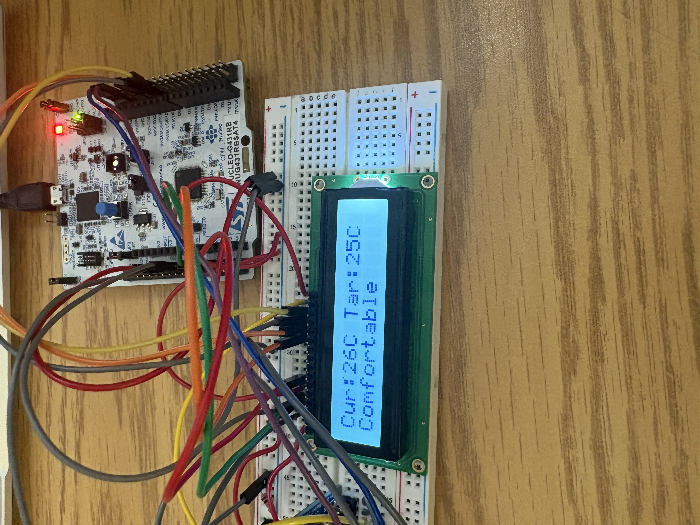
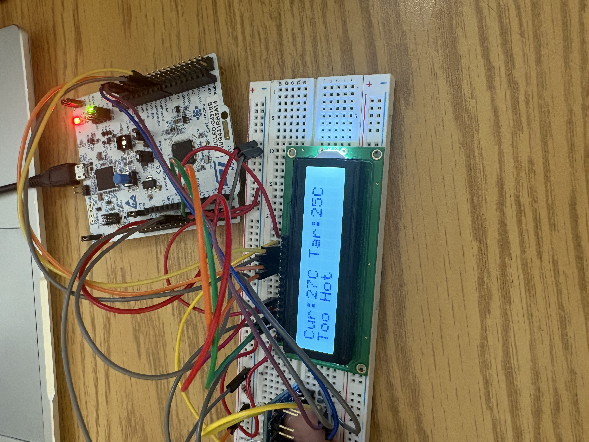
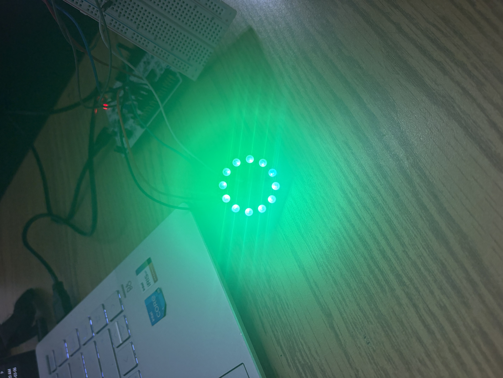

# STM32 Temperature Monitoring & Control System

An embedded temperature monitoring system built on an STM32 microcontroller using an I²C temperature sensor, LCD display, rotary encoder, and NeoPixel LED ring.

The system continuously measures temperature, allows the user to select a target temperature, and provides both numerical and color-based feedback.

## Project Overview

The goal of this project was to integrate multiple sensors and peripherals into a complete STM32 embedded system.

The system reads temperature data from an ADT7420 digital temperature sensor over I²C and displays the current and target temperatures on an LCD.

A rotary encoder allows the user to adjust the target temperature between **15°C and 35°C**.

A 12-LED NeoPixel ring provides visual feedback based on the difference between the measured and target temperatures.

## System Architecture

The overall system operates as:

**ADT7420 Temperature Sensor → STM32 → Temperature Processing**

The STM32 then interfaces with:

- **LCD Display** → Displays current and target temperature
- **Rotary Encoder** → Adjusts the target temperature
- **NeoPixel Ring** → Provides color-based temperature status

## System Operation

The microcontroller continuously reads the current temperature and compares it with the user-selected target.

The NeoPixel ring changes color depending on the temperature condition:

-  **Blue** — measured temperature is below the target range
-  **Green** — measured temperature is within the desired range
-  **Red** — measured temperature is above the target range

This provides a quick visual indication of the current temperature condition.

### Prototype Operation

The LCD displays both the measured temperature and the user-selected target temperature, along with the resulting temperature status.

#### Comfortable State

#### Above Target Temperature

## Hardware

- STM32 NUCLEO-G431RB development board
- ADT7420 digital temperature sensor
- 16×2 LCD display
- Rotary encoder
- 12-LED NeoPixel ring
- Breadboard and supporting components

## Firmware and Peripherals

### I²C Temperature Sensing

The ADT7420 communicates with the STM32 over I²C.

The firmware reads the sensor registers and converts the received data into a temperature value that can be used by the rest of the system.

### LCD Interface

The LCD provides the main numerical user interface.

It displays:

- Current measured temperature
- User-selected target temperature

### Rotary Encoder

The rotary encoder acts as the user input.

Rotating the encoder changes the target temperature in 1°C increments while keeping the setpoint within the allowed **15–35°C** range.

### NeoPixel LED Control

The NeoPixel ring provides visual temperature feedback.

Because NeoPixels require accurately timed digital pulses, the STM32 uses timer-based PWM with DMA to generate the required LED data waveform.

RGB values are converted into the timing sequence required by the LEDs and transferred using DMA.

#### NeoPixel Status Indication

## Software

- C
- STM32 HAL
- STM32CubeIDE
- STM32CubeMX

## Key Embedded Concepts

This project demonstrates:

- I²C communication
- GPIO input and output
- Rotary encoder interfacing
- Timer configuration
- PWM signal generation
- DMA
- LCD interfacing
- Addressable RGB LED control
- Sensor data processing
- Embedded C programming
- Peripheral integration

## Repository Structure

Core/
├── Inc/            Header files
├── Src/            Application and peripheral source files
└── Startup/        STM32 startup code

Drivers/
├── CMSIS/
└── STM32G4xx_HAL_Driver/

ProjectEMB.ioc      STM32CubeMX configuration

The main application logic can be found in:

Core/Src/main.c

LCD interface functions are located in:

Core/Src/lcd.c

What I Learnt

This project gave me practical experience integrating several hardware peripherals into one embedded system.

One of the more challenging parts was controlling the NeoPixel ring because the LEDs require precise communication timing. Using a hardware timer, PWM, and DMA allowed the STM32 to generate the required waveform while the processor handled the rest of the application.

The project also strengthened my understanding of I²C sensor communication, user input handling, LCD interfacing, and organizing embedded firmware around multiple peripherals.

Future Improvements

Possible improvements include:

Adding closed-loop fan control
Adding temperature data logging
Adding over-temperature alarms
Adding wireless monitoring
Improving the user interface
Implementing additional operating modes

